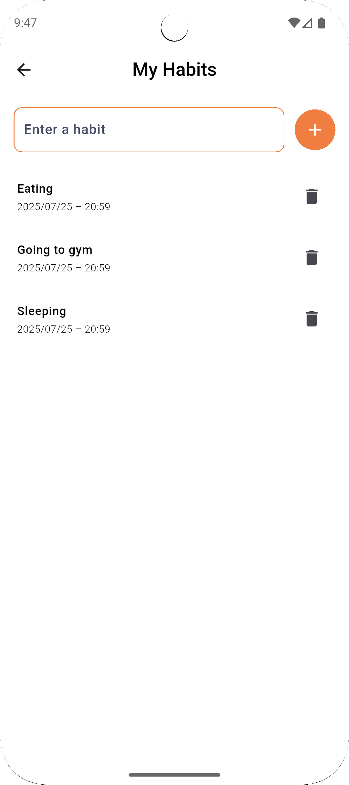

# 📱 AI Habit & Mood Tracker (Flutter + TFLite)

A mobile app built with **Flutter** that helps users track their daily habits and mood, using a custom **TFLite sentiment analysis model** trained in **Google Colab**. The app also analyzes how specific habits influence emotional well-being over time — all offline and privacy-respecting.

---

## 🚀 Features

- ✅ Add and manage personal habits
- 📅 Mark daily habit completion (checkbox interface)
- ✍️ Log your daily mood as text
- 🧠 Automatic mood classification using a TFLite sentiment analysis model (Positive / Neutral / Negative)
- 📊 Visual mood trend overview with pie chart
- 📈 Analyze the impact of habits on mood over time

---

## 💼 Built With

| Tech              | Description                                      |
|-------------------|--------------------------------------------------|
| **Flutter**        | UI and state management                         |
| **Hive**           | Lightweight local data storage (offline-first) |
| **TFLite**         | TensorFlow Lite model for on-device inference  |
| **Tokenizer (JSON)**| Used to convert input text to token sequences  |
| **fl_chart**       | Data visualization (Pie chart)                 |
| **Google Colab**   | Model training and conversion pipeline         |

---

## 🧪 Sentiment Model Details

- **Model Base**: Fine-tuned LSTM (or BERT -> optional explanation)
- **Dataset**: IMDb / custom mood dataset
- **Trained In**: Google Colab (TensorFlow/Keras)
- **Conversion**: Exported to `.tflite` with integer quantization for mobile performance
- **Input**: Tokenized sequence (max_len = 10)
- **Output**: Softmax over 3 classes: `Negative`, `Neutral`, `Positive`

> 💡 Inference is entirely on-device — no internet or cloud required.
---

## 📦 Data Models

| Model         | Description |
|---------------|-------------|
| `Habit`       | The base definition of a habit |
| `HabitEntry`  | Daily status of habit completion |
| `MoodLog`     | Daily mood entry with AI-based sentiment analysis |

---
## ⚙️ Getting Started

### Prerequisites:
- Flutter SDK installed
- Android/iOS emulator or device

### Setup Instructions:

```bash
git clone https://github.com/your-username/habit-mood-tracker.git
cd habit-mood-tracker
flutter pub get
flutter run
````

### Make sure the following files exist:

```
assets/model/sentiment_model.tflite
assets/model/tokenizer.json
```

And are registered in `pubspec.yaml`:

```yaml
flutter:
  assets:
    - assets/model/sentiment_model.tflite
    - assets/model/tokenizer.json

```

## 📈 Screenshots

<table>
  <tr>
    <td align="center">
      <br>
    </td>
    <td align="center">
      <br>
    </td>
    <td align="center">
      <br>
    </td>
  </tr>
  <tr>
    <td align="center">
      <br>
    </td>
    <td align="center">
      <br>
    </td>
    <td align="center">
      <br>
    </td>
  </tr>
</table>


